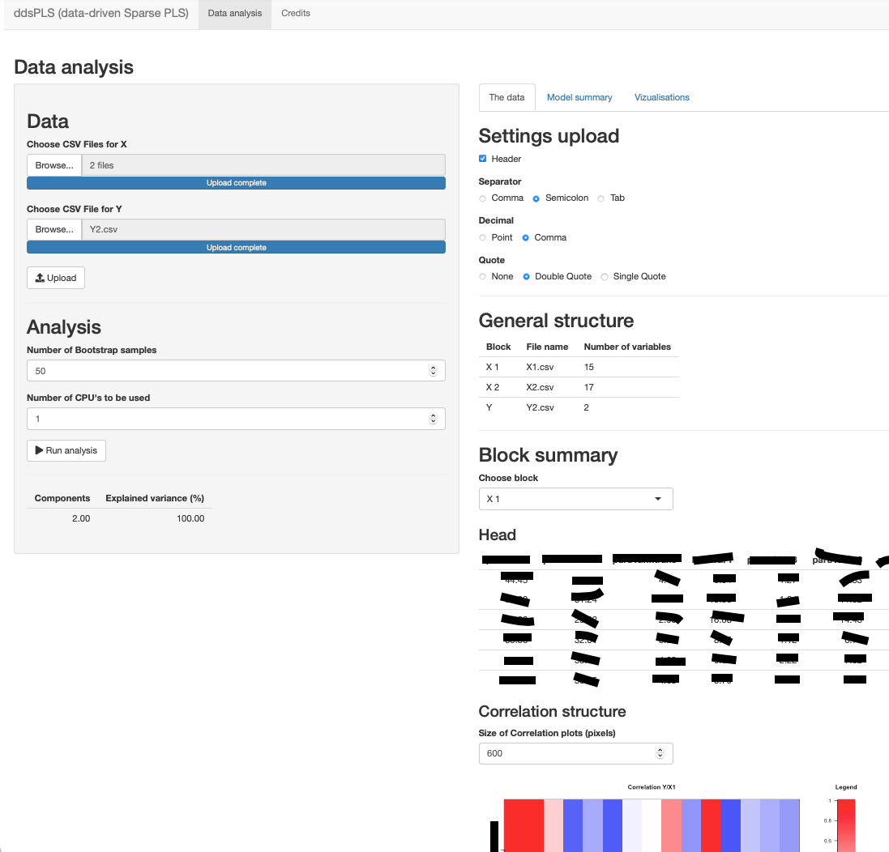

# Data Driven Sparse PLS 2 (**ddsPLS2**)

**ddsPLS2** is a sparse PLS formulation based on soft-thresholding estimations of covariance matrices.

## Installation

There is currently one way to install **ddsPLS2**

  * From the under development repository from GitHub thanks to `devtools`

  ```r
  # install.packages("devtools")
  devtools::install_github("hlorenzo/ddsPLS2", build_vignettes = TRUE)
  ```
  
Once that package is installed, you can access the vignette using that command.

  ```r
  vignette("ddsPLS2")
  ```
  
It is also possible to start a built in applet using 

  ```r
  ddsPLS2_App()
  ```

and it should start an interactive interface which should look like



Thanks for using!
